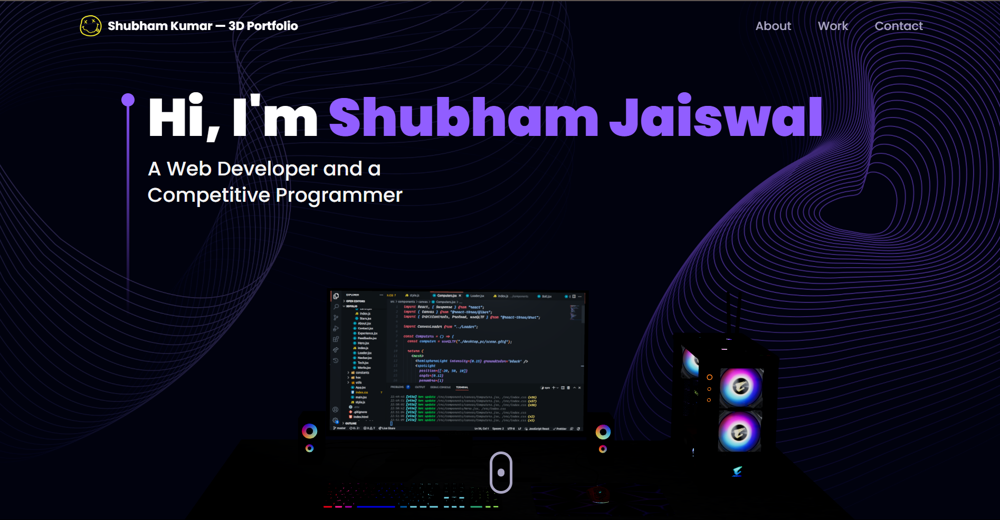
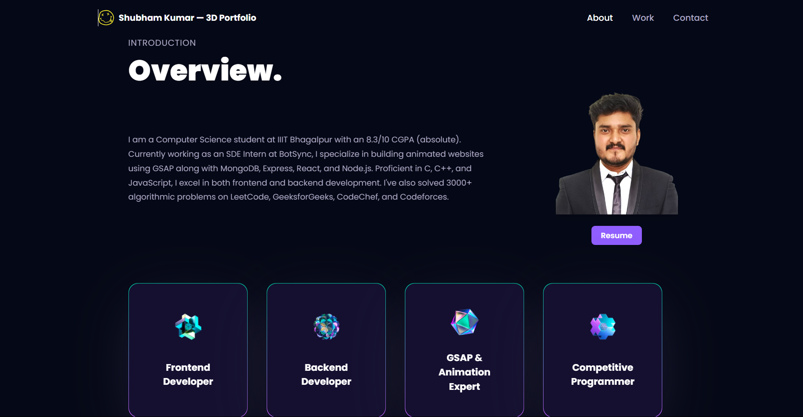
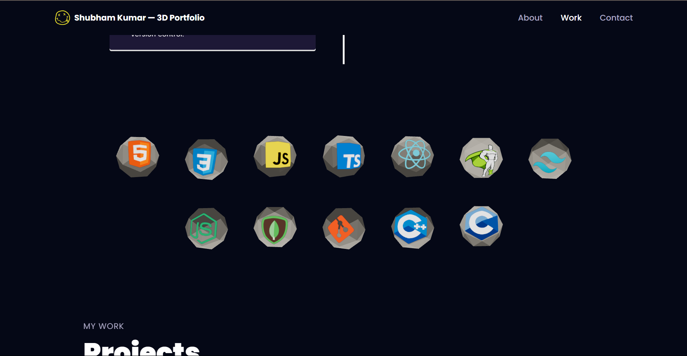
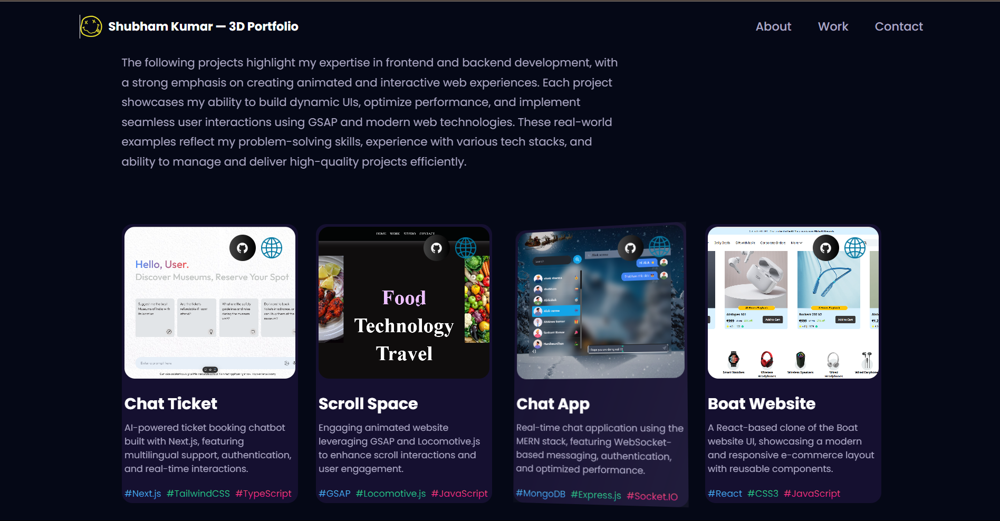

A fully interactive and responsive 3D portfolio website built using Three.js, Vite, and TypeScript. This portfolio showcases personal projects, achievements, resume, and additional details in an engaging 3D environment.

[Live Demo](https://3-d-portfolio-mu-eight.vercel.app/)

---

## Overview
This portfolio website is designed to:
- Showcase personal achievements and projects with interactive 3D elements.
- Provide a modern and immersive user experience.
- Maintain responsiveness across all devices.

---

## Features
- **3D Interactions:** Built with Three.js for a dynamic and engaging visual experience.
- **Responsive Design:** Optimized for desktops, tablets, and mobile devices.
- **Vite-powered Development:** Fast and efficient development experience.
- **TypeScript Integration:** Ensures robust and maintainable code.
- **Smooth Animations:** Enhances user experience with transitions and animations.

---

## Screenshots
### 3D Portfolio Views:





---

## Technologies Used

### Frontend
- **Three.js:** For creating 3D models and animations.
- **TypeScript:** Ensures type safety and maintainability.
- **Vite:** A fast and lightweight build tool for modern web projects.
- **SCSS/CSS:** Styling for a visually appealing interface.

### Hosting
- Hosted on Vercel: [Live Demo](https://3-d-portfolio-mu-eight.vercel.app/)

---

## Installation

### Steps
1. Clone the repository:
   ```bash
   git clone https://github.com/shubham-jaishu/3D-Portfolio.git
   ```

2. Navigate to the project directory:
   ```bash
   cd 3D-Portfolio
   ```

3. Install dependencies:
   ```bash
   npm install
   ```

4. Run the development server:
   ```bash
   npm run dev
   ```

5. Open the project in your browser at:
   ```
   http://localhost:5173/
   ```

---

## How It Works
1. **Three.js Integration:** Uses Three.js to render 3D elements and animations.
2. **Vite Build System:** Provides a fast and efficient development workflow.
3. **TypeScript Support:** Ensures a scalable and error-free codebase.
4. **Optimized Performance:** Leverages best practices for smooth rendering.

---

## Future Improvements
- Add interactive elements to enhance user engagement.
- Implement a content management system for dynamic updates.
- Improve accessibility for a broader audience.

---

## Contribution
Contributions are welcome! Feel free to fork the repository and submit a pull request.

---

## Contact
For queries or feedback, please contact [Shubham](mailto:shubhamjaishu@gmail.com).
